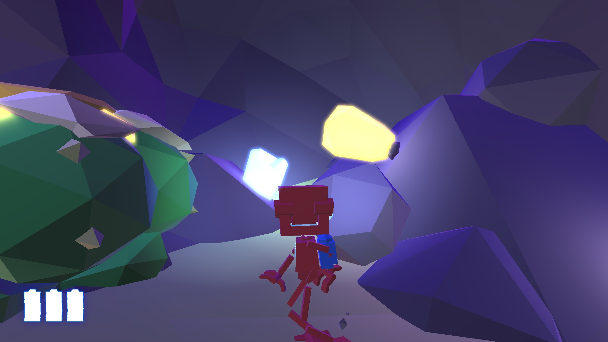

# Design -- Overview

- Low-poly art-style emphasizing bright, solid colors and lighting/shadows => simple assets.
  <table style="border: 1px black solid">
    <tbody>
      <tr><td>
<em>A screenshot of Grow Up</em>
</td></tr>
      <tr><td></td></tr>
    </tbody>
  </table

  - References
    - Grow Home, Grow Up
    - Risk of Rain 2
    - Tunic
    - The Legend of Zelda, Wind-Waker
    - Minecraft

Gameplay is primarily shaped by two constraints:
- We would like to play with a controller.
- We would like the budget for this game to be as low as possible, i.e. no complex artwork or assets needed.

Thus, opt for the following approach:
- Resource gathering (much like Monster Hunter)
- Construction
  - Trains (conveyor belts or half-open pipes) to transport resources.
  - Towers to defend against monsters
  - Monitoring: can alert user when a large monster enters an area
  - Terraforming
    - Dams can remove water from a downstream area
    - Can introduce water into an area
- Monsters to hunt
  - Monsters are very smart: they will try to interfere with resource gathering to their benefit.  
    E.g. a monster may intercept a train of resources to eat the resources and gain a buff.
  - Occasionally, legendary monsters will appear, prompting the player to focus on this confrontation.
